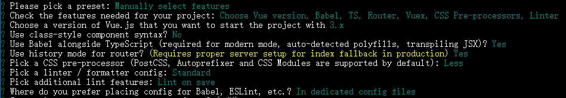
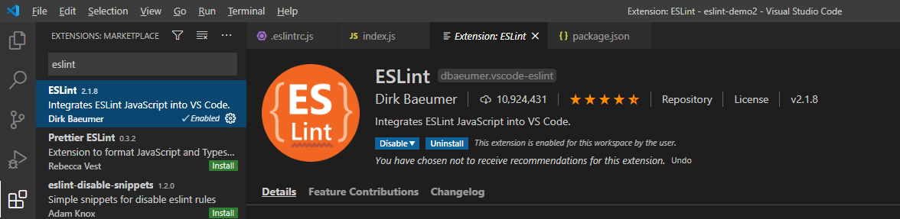
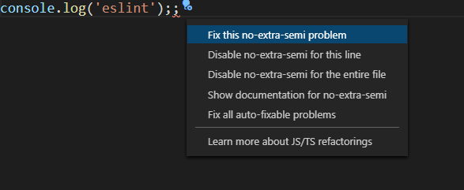

# Vue 项目配置及前端开发规范

- [Vue CLI4 安装](#install)
- [目录结构规范](#catalogue)
- [ESlint + Standard 统一代码规范](#eslint)
- [CSS 预处理器以及全局样式](#less)
- [UI 组件库规范](#ui)
- [封装 axios 和 api](#axios)
- [登录拦截](#login)
- [权限控制](#authorization)

## <span id="install">Vue CLI4 安装</span>

参考 [Vue CLI 官方文档](https://cli.vuejs.org/zh/guide/installation.html)

初始化项目配置参考：



[▲ 回顶部](#top)

## <span id="catalogue">目录结构规范</span>

[▲ 回顶部](#top)

## <span id="eslint">ESlint + Standard 统一代码规范</span>

ESLint 是在 ECMAScript/JavaScript 代码中识别和报告模式匹配的工具，它的目标是保证代码的一致性和避免错误。统一代码规范，有助于个人养成良好的代码习惯，同时也可以降低团队开发的代码维护成本。 ESLint 的详细用法和检查规则可以参考 [官方文档](https://eslint.bootcss.com/)。

Vue CLI 初始化的时候可以选择安装 ESLint 和 Standard 代码风格，你也可以通过运行 `vue add eslint` 命令来初始化 ESLint，其中 `.eslintrc.js` 是 ESLint 的配置文件。修改 `eslintrc.js` 的 `rules`：

```js
module.exports = {
  // ...
  rules: {
    'no-console': process.env.NODE_ENV === 'production' ? 'warn' : 'off',
    'no-debugger': process.env.NODE_ENV === 'production' ? 'warn' : 'off',
    '@typescript-eslint/no-var-requires': 'off',
    '@typescript-eslint/explicit-module-boundary-types': 'off',
    '@typescript-eslint/no-explicit-any': 'off'
  }
}
```

### VS Code 安装 ESLint 插件

在 VS Code 中安装 ESLint 插件，该插件会检测和应用项目中的 `.eslintrc.js`，并且在编码阶段就对不符合规则的代码作出提示，还能对错误进行修改。





修改 VS Code 的 `settings.json`（File -> Preferences -> Settings -> Text Editor -> Code Actions On Save -> Edit in settings.json），可以在保存文件的时候自动根据规则修复：

```json
{
    "editor.codeActionsOnSave": {
        "source.fixAll.eslint": true
    }
}
```

### Vue 风格指南

参考 [《Vue 风格指南》](https://v3.cn.vuejs.org/style-guide/)

### 拼写检查插件

VS Code 上安装 Code Spell Checker 插件，可以用于检查拼写错误，减少代码的语法错误。

[▲ 回顶部](#top)

## <span id="less">CSS 预处理器以及全局样式</span>

CSS 预处理器是 CSS 的扩展语言，一般支持变量、嵌套、混合等编程语言的特性，使用 CSS 预处理器可以减少 CSS 冗余代码，提高编写 CSS 的效率。比较推荐的 CSS 预处理器是 [Less](https://less.bootcss.com/) 和 [SCSS](https://www.sass.hk/guide/)，这两者本质上没有太大的区别，只是语法层面的不同。

### Less 踩坑

如果安装的 Less 版本太高，可能会报错，建议锁定 Less 版本： `less@3.0.4` 和 `less-loader@5.0.0`

### 全局样式

对于通用的样式，建议以全局样式进行导入（以 Less 为例）：

创建 `src/styles/reset.css`，用于统一浏览器的默认样式：

```css
/* 覆盖默认样式 */
html, body, div, span, applet, object, iframe,
h1, h2, h3, h4, h5, h6, p, blockquote, pre,
a, abbr, acronym, address, big, cite, code,
del, dfn, em, img, ins, kbd, q, s, samp,
small, strike, strong, sub, sup, tt, var,
b, u, i, center,
dl, dt, dd, ol, ul, li,
fieldset, form, label, legend,
table, caption, tbody, tfoot, thead, tr, th, td,
article, aside, canvas, details, embed,
figure, figcaption, footer, header, hgroup,
menu, nav, output, ruby, section, summary,
time, mark, audio, video {
  margin: 0;
  padding: 0;
  border: 0;
  font-size: 100%;
  font: inherit;
  vertical-align: baseline;
}
/* HTML5 display-role reset for older browsers */
article, aside, details, figcaption, figure,
footer, header, hgroup, menu, nav, section {
  display: block;
}
body {
  line-height: 1;
}
ol, ul {
  list-style: none;
}
blockquote, q {
  quotes: none;
}
blockquote:before, blockquote:after,
q:before, q:after {
  content: '';
  content: none;
}
table {
  border-collapse: collapse;
  border-spacing: 0;
}
```

创建 `src/styles/global.less`，引入 `reset.css`：

```css
@import './reset.css';

// 定义全局通用样式
```
除了覆盖默认样式，还可以在 `global.less` 中定义一些全局通用的样式。

最后在 `src/main.ts` 中引入 `global.less`。

### 自动化导入变量、混合

对于 CSS 预处理器中，通用的变量或者混合，比如通用颜色，也建议分离成通用样式，全局样式的目录规范：

```sh
├─ src
  ├─ styles
    ├─ global.less            # 全局样式
    ├─ mixins.less            # 全局 mixin
    ├─ reset.css              # 覆盖浏览器默认样式
    ├─ variables.less         # 全局变量
```

尽管定义了通用的 `variables.less` 和 `mixins.less`，使用时仍然需要在用到的每个组件中手动导入，较为繁琐，因此需要自动化导入这些文件。

首先，安装插件：

```sh
npm install --save-dev style-resources-loader vue-cli-plugin-style-resources-loader
```

然后修改 `vue.config.js` 配置文件：

```js
const path = require('path')

module.exports = {
  pluginOptions: {
    'style-resources-loader': {
      preProcessor: 'less',
      patterns: [
        path.resolve(__dirname, './src/styles/mixins.less'),
        path.resolve(__dirname, './src/styles/variables.less')
      ]
    }
  }
}
```

这样，在单个组件中，不需要手动导入，就可以使用 CSS 预处理器定义的全局变量和混合。

[▲ 回顶部](#top)

## <span id="ui">UI 组件库规范</span>

UI 组件库的不做统一的要求，根据策划和设计的需求，以及项目的需要来选择，建议从常见的 UI 组件库中选择，例如：[Element UI](https://element-plus.gitee.io/zh-CN/guide/design.html)，[Ant Design Vue](https://next.antdv.com/docs/vue/migration-v3-cn) 和 [Vant](https://vant-contrib.gitee.io/vant/#/zh-CN/) 等，这些组件库由大公司的团队在维护，较为稳定，使用群体相对比较大，有些坑别人已经踩过了，且都已经升级到 Vue3.0。

### 踩到坑如何解决？

百度或者到官方 github 项目的 issue 中寻求解决方案。

### 按需加载

以上提到组件库的官方文档中，都会有按需加载相关的内容，建议在实际项目开发中或者后期性能优化时，实现按需加载。在开发过程中，我们一般只用到组件库中的一部分组件，如果导入整个组件库，会增加整个项目的体积，降低网站的性能。

按需引入，建议在一个单独的文件中进行全局引入，方便扩展，同时避免 `src/main.ts` 入口文件代码混乱，以 Ant Design Vue 为例：

创建 `src/plugins/ant-design-vue.ts`：

```ts
import {
  Button,
  message
} from 'ant-design-vue'

export default function loadAntDesignVue (app: any) {
  app.use(Button)

  app.config.globalProperties.$message = message
}
```

在 `src/main.ts` 中引入：

```ts
import { createApp } from 'vue'
import App from './App.vue'
import router from './router'
import store from './store'
import loadAntDesignVue from './plugins/ant-design-vue'

const app = createApp(App)

loadAntDesignVue(app) // 引入组件库

app.use(store).use(router).mount('#app')
```

补充：如何在 `setup` 中使用全局 `property`：

```ts
import { defineComponent, onMounted, getCurrentInstance } from 'vue'

export default defineComponent({
  name: 'HelloWorld',
  setup () {
    const { proxy } = getCurrentInstance() as any

    onMounted(() => {
      proxy.$message.success('success')
    })
  }
})
```

## <span id="axios">封装 axios 和 api</span>

Vue 项目一般采用 [axios](http://www.axios-js.com/zh-cn/docs/) 进行接口请求。封装 axios 的好处：对 axios 进行统一配置，有利于项目的迭代和维护。

### 封装 axios

#### 基本配置

`axios` 的使用参考 [axios 中文文档](http://www.axios-js.com/zh-cn/docs/)。

创建 `src/api/utils/http.ts`，对 axios 进行封装：

```ts
import axios from 'axios'
import { notification } from 'ant-design-vue'

const http = axios.create({
  baseURL: 'http://xxx/api', // api base_url
  timeout: 10000 // 请求超时时间
})

// 请求拦截
http.interceptors.request.use(
  config => config,
  error => Promise.reject(error)
)

// 响应拦截
http.interceptors.response.use(
  response => response.data,
  error => {
    if (error.response) {
      // 提示错误信息
      const { status, data } = error.response
      notification.error({
        message: status,
        description: data.message
      })
    }
    return Promise.reject(error)
  }
)

export default http
```

以上为基本的 `axios` 配置，可以根据实际需要进行扩展，例如，在请求头中统一添加鉴权 token，登录过期重定向到登录页等。

#### 封装 get 和 post 请求

请求可以有多种请求方式，例如 `GET`、`POST`、`PUT`、`DELETE` 等，为了简化代码，可以对 `axios` 进一步封装：

```ts
import axios from 'axios'

const http = axios.create({
  baseURL: 'http://xxx/api', // api base_url
  timeout: 10000 // 请求超时时间
})

// ...

export default http

// 封装 get 请求
export const get = (url: string, params = {}, config = {}) => {
  return http({
    url,
    method: 'GET',
    params,
    ...config
  })
}

// 封装 post 请求
export const post = (url: string, data = {}, config = {}) => {
  return http({
    url,
    method: 'POST',
    data,
    ...config
  })
}

```

#### 环境的切换

项目环境包含开发环境、生产环境和测试环境。为了区分不同的环境，可以创建环境文件来指定环境变量，参考：[Vue CLI 模式与环境变量](https://cli.vuejs.org/zh/guide/mode-and-env.html)

创建 `.env.development` 和 `.env.production`：

```
NODE_ENV=development
VUE_APP_API_BASE_URL=http://xxx/api
```

```
NODE_ENV=production
VUE_APP_API_BASE_URL=http://xxx.com/api
```

修改 `src/api/utils/http.ts`：

```ts
const http = axios.create({
  baseURL: process.env.VUE_APP_API_BASE_URL, // api base_url
  timeout: 10000 // 请求超时时间
})
```

### api 模块化管理

在 `src/api` 目录下管理 api，每个模块的 api 对应一个文件，便于扩展和维护。例如：

```sh
├─ src
  ├─ api
    ├─ utils
      └─ http.js
    ├─ course.js
    └─ login.js
```

结合之前封装 axios， 单个模块的内容可以为：

```js
// login.ts

import { get, post } from './utils/http'

export const login = (data = {}) => post('/user/login', data)

export const getInfo = () => get('/user/info')
```

调用接口：

```js
import { login } from '@/api/login'

login({
  account: 'admin',
  password: '123456'
}).then(res => {
  // ...
})
```

> 注意：一般情况下，如果接口需要传递参数，推荐像上面 `login` 接口一样原封不动传 `data` 参数，这样调接口的时候，参数就和 api 文档保持一致，只需要查看 api 文档即可，否则调用接口既需要看 api 文档，还要修改接口的封装，参考下面的说明。

```js
// 推荐的写法：
export const login = (data = {}) => post('/user/login', data)

login({
  account: 'admin',
  password: '123456'
})

// 不推荐的写法：
export const login = (account: string, password: string) => post('/user/login', {
  account,
  password
})

login('admin', '123456')
```

[▲ 回顶部](#top)

## <span id="login">登录拦截</span>

### 登录拦截实现原理

1. 路由拦截，每次访问页面前，先检查本地是否有 token，如果没有，则跳转到登录页，执行第 2 步；如果有，执行第 3 步
2. 用户使用账号密码登录后，获取 token，将 token 缓存到本地
3. 所有（需要鉴权）的接口访问时，都要在请求头中携带 token
4. 携带 token 请求数据，如果返回 401 未授权，说明 token 过期，需要跳转到登录页，执行第 2 步

### 登录拦截实现过程

1. Vuex 封装登录和退出登录接口

```ts
// src/store/modules/user.ts
import { login, getInfo } from '@/api/login'

const user = {
  state: {
    info: null // 用户基本信息，用户判断是否登录
  },
  mutations: {
    SET_INFO (state: any, info: any) {
      state.info = info
    }
  },
  actions: {
    // 封装登录接口
    async Login (state: any, loginInfo = {}) {
      try {
        const res = await login(loginInfo)
        const token = res.data.token
        // 缓存 token
        localStorage.setItem('token', `Bearer ${token}`)
      } catch (error) {
        return Promise.reject(error)
      }
    },
    // 获取用户基本信息，用于判断登录是否过期
    async GetInfo ({ commit }: { commit: any }) {
      try {
        const res = await getInfo()
        const info = res.data
        commit('SET_INFO', info)
      } catch (error) {
        return Promise.reject(error)
      }
    },
    // 退出登录
    async Logout ({ commit }: { commit: any }) {
      // TODO 退出登录接口（如果需要）
      // 移除 token，清空个人信息
      localStorage.removeItem('token')
      commit('SET_INFO', null)
    }
  }
}

export default user

```

```ts
// src/store/index.ts
import { createStore } from 'vuex'
import user from './modules/user'

export default createStore({
  state: {
  },
  mutations: {
  },
  actions: {
  },
  modules: {
    user
  }
})
```

2. 请求拦截和响应拦截（参考 [封装 axios 和 api](#axios)）

```ts
// src/api/utils/http.ts

import axios from 'axios'
import { notification } from 'ant-design-vue'
import store from '@/store'

const http = axios.create({
  baseURL: process.env.VUE_APP_API_BASE_URL, // api base_url
  timeout: 10000 // 请求超时时间
})

// 请求拦截
http.interceptors.request.use(
  (config: any) => {
    // 请求头携带 token
    const token = localStorage.getItem('token')
    if (token) {
      config.headers.Authorization = token
    }
    return config
  },
  error => Promise.reject(error)
)

// 响应拦截
http.interceptors.response.use(
  response => response.data,
  error => {
    if (error.response) {
      // 提示错误信息
      const { status, data } = error.response
      notification.error({
        message: status,
        description: data.message
      })
      if (status === 401) {
        // token 过期，打开登录页（路由守卫）
        store.dispatch('Logout').then(() => {
          setTimeout(() => {
            window.location.reload()
          }, 1000)
        })
      }
    }
    return Promise.reject(error)
  }
)
```

2. 路由守卫，登录拦截

```ts
// src/router/index.ts

import { createRouter, createWebHistory, RouteRecordRaw } from 'vue-router'
import store from '@/store'
import { notification } from 'ant-design-vue'

const routes: Array<RouteRecordRaw> = [
  {
    path: '/',
    redirect: '/home'
  },
  {
    path: '/home',
    name: 'Home',
    component: () => import('@/views/Home.vue')
  },
  {
    path: '/login',
    name: 'Login',
    component: () => import('@/views/Login.vue')
  }
]

const router = createRouter({
  history: createWebHistory(process.env.BASE_URL),
  routes
})

// 免登录白名单
const whiteList = ['/login']

// 路由守卫，登录拦截
router.beforeEach((to, from, next) => {
  const token = localStorage.getItem('token')
  if (token) {
    if (to.path === '/login') {
      next('/')
    } else {
      if ((store.state as any).user.info) {
        // vuex 可以获取到用户信息，说明 token 有效
        next()
      } else {
        // 刷新页面，或者关闭页面后重新打开，vuex 失效，则重新获取
        store.dispatch('GetInfo')
          .then(() => {
            // 可以获取到登录状态，说明 token 仍然有效
            next()
          })
          .catch(() => {
          // 获取失败，重新登录
            notification.error({
              message: '错误',
              description: '请求用户信息失败，请重试'
            })
            store.dispatch('Logout').then(() => {
              next('/login')
            })
          })
      }
    }
  } else {
    // 没有 token（未登录/已退出登录）
    if (whiteList.includes(to.path)) {
      // 免登录白名单，不需要登录
      next()
    } else {
      // 跳转到登录页
      next('/login')
    }
  }
})

export default router
```

[▲ 回顶部](#top)

## <span id="authorization">权限控制</span>

如果系统中存在多个角色，例如超级管理员和普通管理员，则不同角色对资源的访问应该进行权限控制。

### 路由权限及侧边栏

#### 路由权限

##### 路由权限的实现思路

1. 后端应该提供 `roles(Array)` 字段，前端登录后可以获取到用户所属角色；
2. 前端实现基本/通用路由表，这个路由表是静态的，包含不需要登录就可以访问的公共页面，例如：登录页、404 页面等；
3. 准备需要根据权限动态加载的路由表，这个路由表可以是前端定义，也可以是后台创建，前端定义的路由表内指定允许访问的角色列表；
4. 用户登录后，根据 `roles` 比对动态路由表，筛选出可以访问的动态路由表，合并通用路由表，最终生成用户可以访问的路由表。

##### 路由权限的具体实现

1. 创建通用路由表

```ts
// src/router/index.ts

import { createRouter, createWebHistory, RouteRecordRaw } from 'vue-router'

// 通用路由表
export const constantRouterMap: Array<RouteRecordRaw> = [
  {
    path: '/login',
    component: () => import('@/views/Login.vue')
  },
  {
    path: '/404',
    component: () => import('@/views/404.vue')
  }
]

const router = createRouter({
  history: createWebHistory(process.env.BASE_URL),
  routes: constantRouterMap
})

export default router
```

2. 创建动态路由表

前端：

```ts
// src/router/index.ts

// 动态路由表
export const asyncRouterMap: Array<RouteRecordRaw> = [
  {
    path: '/',
    component: BasicLayout,
    redirect: '/home',
    children: [
      {
        path: '/home',
        name: 'Home',
        component: () => import('@/views/Home.vue'),
        meta: { title: '首页', icon: 'home' }
      }
    ]
  },
  {
    path: '/user',
    name: 'User',
    component: () => import('@/views/User.vue'),
    meta: { title: '用户管理', icon: 'user', roles: ['operator'] }
  },
  {
    path: '/system',
    component: BasicLayout,
    redirect: '/system/role',
    meta: { title: '系统管理', icon: 'setting', roles: ['admin'] },
    children: [
      {
        path: '/system/role',
        name: 'SystemRole',
        component: () => import('@/views/system/SystemRole.vue'),
        meta: { title: '角色管理' }
      },
      {
        path: '/system/menu',
        name: 'SystemMenu',
        component: () => import('@/views/system/SystemMenu.vue'),
        meta: { title: '菜单管理' }
      }
    ]
  },
  {
    path: '/:pathMatch(.*)*', // Vue-Router4 取消了 *、/* 等正则匹配
    redirect: '/404'
  }
]
```

上面的例子包含两种角色：普通运营（operator）和超级管理员（admin），通过 `meta.roles` 指定允许访问的角色，不指定时所有角色都可以访问。

最后其他未匹配到的路由，需要重定向到 404 页面。

有些时候，路由表不像上面的例子在前端配置，而是需要在后台动态配置页面/菜单信息：


3. `Vuex` 管理路由权限

```ts
// src/store/modules/permission.ts

import { constantRouterMap, asyncRouterMap } from '@/router'
import { RouteRecordRaw } from 'vue-router'

// 判断用户是否拥有当前页面的权限
function hasPermission (route: any, roles: Array<string>): boolean {
  if (route.meta?.roles) {
    return roles.some(role => route.meta.roles.includes(role))
  }
  return true
}

// 根据权限过滤，获取动态路由表
function filterAsyncRouters (routerMap: Array<RouteRecordRaw>, roles: Array<string>): Array<RouteRecordRaw> {
  const accessedRouters = routerMap.filter(route => {
    // 超级管理员，返回全部路由
    if (roles.includes('admin')) {
      return true
    }
    // 用户有权限
    if (hasPermission(route, roles)) {
      // 处理子路由
      if (route.children && route.children.length) {
        route.children = filterAsyncRouters(route.children, roles)
      }
      return true
    }
    return false
  })
  return accessedRouters
}

const permission = {
  state: {
    routers: constantRouterMap,
    addRouters: []
  },
  mutations: {
    SET_ROUTERS (state: any, routers: Array<RouteRecordRaw>) {
      state.addRouters = routers
      state.routers = constantRouterMap.concat(routers)
    }
  },
  actions: {
    async GenerateRoutes ({ commit }: { commit: any }, roles: Array<string>) {
      // 根据 roles 权限做筛选
      const accessedRouters = filterAsyncRouters(asyncRouterMap, roles)
      commit('SET_ROUTERS', accessedRouters)
    }
  }
}

export default permission
```

4. 路由守卫

路由权限控制需要基于登录功能，参考上文 [登录拦截](#login)。

```ts
// src/router/index.ts

// 免登录白名单
const whiteList = ['/login', '/404']

// 路由守卫，登录拦截
router.beforeEach(async to => {
  const token = localStorage.getItem('token')
  if (token) {
    if (to.path === '/login') {
      return '/'
    }
    if ((store.state as any).user.roles.length) {
      // vuex 可以获取到用户信息，说明 token 有效
      return true
    }
    try {
      // 刷新页面，或者关闭页面后重新打开，vuex 失效，则重新获取
      await store.dispatch('GetInfo')
      const roles = (store.state as any).user.roles
      // 动态分发路由
      await store.dispatch('GenerateRoutes', roles);
      (store.state as any).permission.addRouters.forEach((route: RouteRecordRaw) => {
        router.addRoute(route)
      })
      return to.fullPath
    } catch (error) {
      // 获取失败，重新登录
      notification.error({
        message: '错误',
        description: '请求用户信息失败，请重试'
      })
      await store.dispatch('Logout')
      return '/login'
    }
  } else {
    if (whiteList.includes(to.path)) {
      // 免登录白名单，不需要登录
      return true
    }
    return '/login'
  }
})
```

#### 侧边栏

侧边栏基于路由权限，只有用户有权访问的页面，才会在侧边栏的菜单中出现。一般的做法是基于组件库的侧边栏/菜单组件，使用递归组件，根据路由表进行渲染。参考 [Ant-Design-Vue-导航菜单-单文件递归菜单](https://next.antdv.com/components/menu-cn#components-menu-demo-template)。

如果不希望某个特定的路由出现在侧边栏中，可以添加 `meta.hidden` 字段，渲染菜单时根据需要隐藏。

侧边栏除了点击菜单显示对应页面，还应该实现：根据路由展开/高亮对应的菜单。做法是在侧边栏组件被创建时，以及监听（`watch`）路由变化时，比对当前路由和侧边栏，展开/高亮对应菜单。
